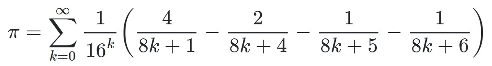
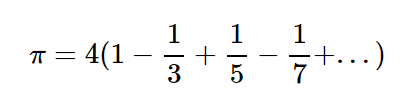
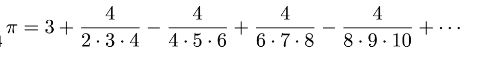

# Sixth-Assignment-Advanced-Multithreading-Report

In this project I calculate Pi with three algorithm to find the best and fastest way to calculate pi with 1000 digits after decimal point 
## algorithms 
### 1- Gregory-Leibniz Series:


* this algorithm can only pass one test and have a big mistake to calculate pi 
and only git four correct digit after decimal point .
* as you can see this algorithm is really simple and I have not except really good answer from this 
```java
        public void run() {
            BigDecimal numerator = new BigDecimal(1);
            BigDecimal sign = new BigDecimal(1);
            if (n%4 == 3) {
                sign = new BigDecimal(-1);
            }
            if (n%2 == 1) {
                numerator = numerator.multiply(sign, mc);
                numerator = numerator.divide(BigDecimal.valueOf(n), mc);
                numerator = numerator.multiply(BigDecimal.valueOf(4), mc);
            } else {
                numerator = BigDecimal.valueOf(0);
            }
            BigDecimal result = numerator;
            addTouSum(result);
        }
```
* in run function I tell to every threads to calculate deductions with given value n .
* than get the result to `addToSum` functions to add the result to sum .
### 2- Nilakantha Series:

* this algorithm is more accurate than previous algorithm and have more correct digits but pass only one test too .
* This was the code that I used to calculate the π number. Even though it was working properly, But when you want a higher floating point, It doesn't give you the exact value.
```
        public void run() {
            BigDecimal sign = new BigDecimal(1);
            if (n % 2 == 0)
            {
                sign = new BigDecimal(-1);
            }
            BigDecimal numerator = new BigDecimal(4).divide(new BigDecimal((2*n)*(2*n + 1)*(2*n + 2)) , mc).multiply(sign , mc) ;

            addTouSum(numerator);
        }
```
* this is the implementation of this algorithm in java with multi thread .
* the factorial function used for calculate factorial of numbers .
### 3- BBP (Bailey-Borwein-Plouffe) Formula (MAIN):

The BBP (Bailey–Borwein–Plouffe) algorithm, discovered by Simon Plouffe in 1995, is another significant method for calculating the digits of π. Its distinctive feature is that it allows the extraction of individual hexadecimal (or binary) digits of π without needing to compute all preceding digits. Here are the key points:

1. Mathematical Foundation: The BBP formula for π is based on a series that allows direct computation of the nth digit of π in base 16 (hexadecimal). The series used in the BBP formula is:
2. Digit Extraction: The key innovation of the BBP algorithm is its ability to compute the nth digit of π directly, without needing to calculate the preceding digits. This property is known as "digit extraction."
3. Efficiency: The algorithm is particularly efficient for computing isolated hexadecimal or binary digits of π. However, it is not as efficient as algorithms like the Chudnovsky algorithm for computing a large number of sequential digits.
4. Applications: The BBP algorithm's digit extraction capability has been used in distributed computing projects and other applications where specific digits of π are needed rather than the entire sequence up to those digits. The BBP algorithm's unique feature of digit extraction without prior digits has made it a subject of great interest in the mathematical community, particularly in the study of normal numbers and computational mathematics.
* This formulae may not give you the exact value of π, But it's really close to actual value.
* You can see the difference between the calculated value and the actual value where you run the test with fewer threads.
```
        public void run() {
            BigDecimal num1 = new BigDecimal(1).divide(new BigDecimal(16).pow(n , mc) , mc);
            BigDecimal num2 = new BigDecimal(String.valueOf(new BigDecimal(4).divide(new BigDecimal(8*n + 1), mc)));
            BigDecimal num3 = new BigDecimal(String.valueOf(new BigDecimal(2).divide(new BigDecimal(8*n + 4), mc)));
            BigDecimal num4 = new BigDecimal(String.valueOf(new BigDecimal(1).divide(new BigDecimal(8*n + 5), mc)));
            BigDecimal num5 = new BigDecimal(String.valueOf(new BigDecimal(1).divide(new BigDecimal(8*n + 6), mc)));
            BigDecimal resulet = ((num2.subtract(num3)).subtract(num4)).subtract(num5);
        
            resulet = resulet.multiply(num1);
            addTouSum(resulet);
        }
```
* Here in run() I tell every thread to calculate a single deduction with a given value of n.
* After they calculate, the result will be added to a value where it stores sum of all results with the method addToSum(result).

## Why did I get wrong Answer :
* I didn't give the right answer for last test because the amount of deductions that calculate was low .
* I don't used All of my variable with Type big decimal and have error
* doesn't give the Type that `new BigDecimal(Type)` want .

## Execute the program
Start the program from main:
1. First you have to enter the floating point.
2. Then it makes ten threads with thread pool.
3. In a loop it calculates every series with a thread.
4. Every thread has run() method that I mentioned before.
5. After it done its work, we have to round the number by floating point.
6. All done, and it finally shows the π number with the floating number you chose.

* Floating Point: 10
* π: 3.1415926535

## How thread pool work : 
1. Declare a thread pool with ExecutorService threadPool = Executors.newFixedThreadPool(10);.
2. As you can see I made 16 threads (preferred be pow of 2 ).
3. In loop when I give task to thread all ten of them works parallel.
4. When one of them finished, the other thread replace with it.
5. These go until the loop finish.
## Implementing Semaphor
### usage 
* Semaphores are synchronization tools used in concurrent programming to control access to shared resources by multiple threads or processes, thereby avoiding race conditions and ensuring safe resource sharing
* Semaphores are fundamental in ensuring proper synchronization and coordination among concurrent threads and processes, preventing issues like race conditions, deadlocks, and resource starvation.
## Pros and Cons :
Semaphores are a powerful synchronization primitive used in multithreading, but they come with their own advantages and disadvantages compared to other multithreading methods like mutexes, condition variables, and read-write locks. Here's a comparison of their pros and cons:
## Summary 
Semaphores are versatile and powerful but come with a higher risk of misuse and complexity in certain scenarios. They are best used when managing a fixed number of resources or handling more complex synchronization patterns. For simple mutual exclusion, mutexes are often preferable due to their simplicity and lower overhead. Condition variables are ideal for more complex waiting conditions, while read-write locks provide better performance in scenarios with many readers and fewer writers. Choosing the right synchronization method depends on the specific requirements and complexity of the multithreading problem at hand.
## Resources 
* 🔗 [Thread Pools (Geeks for Geeks)](https://www.geeksforgeeks.org/thread-pools-java/)
* 🔗 [Computing π with the Bailey-Borwein-Plouffe Formula](https://observablehq.com/@rreusser/computing-with-the-bailey-borwein-plouffe-formula)
* 🔗 [Gregory-Leibniz Series](https://crypto.stanford.edu/pbc/notes/pi/glseries.html)
* 🔗 [Nilakantha Series](https://www.geeksforgeeks.org/calculate-pi-using-nilkanthas-series/)

